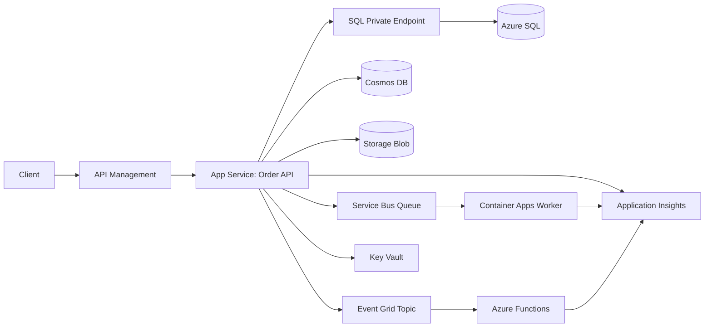

# Azure Order Flow Proof of Concept

This proof of concept demonstrates a small, end-to-end Azure workload using:

- App Service
- Azure Functions
- Azure Storage
- Azure Key Vault
- Managed Identity
- Application Insights
- Azure SQL
- Azure Container Apps
- CI/CD
- Service Bus
- Event Grid
- API Management
- Cosmos DB

## PoC Question

Can a managed-identity-first Azure application process an order through synchronous API intake, asynchronous messaging, event notification, relational persistence, document persistence, blob archival, and observable worker processing with a repeatable deployment path?

## Architecture



## Service Mapping

| Service | Use in this PoC |
| --- | --- |
| App Service | Hosts the order intake API behind APIM and validates the APIM-injected backend key. |
| API Management | Publishes the API surface, requires subscriptions, rate limits requests, and injects the backend key. |
| Azure SQL | Stores normalized order status records. |
| Cosmos DB | Stores full order documents for flexible reads. |
| Azure Storage | Archives original order payloads as blobs and provides separate identity-backed Function host storage. |
| Service Bus | Decouples order processing from API intake. |
| Event Grid | Emits order-created lifecycle events. |
| Azure Functions | Handles Event Grid events for notifications or projections. |
| Container Apps | Runs the background order worker. |
| Key Vault | Stores application configuration and connection strings. |
| Managed Identity | Grants apps access to Azure resources without embedded secrets. |
| Application Insights | Captures traces, logs, dependencies, and metrics. |
| CI/CD | GitHub Actions builds, validates, provisions, and deploys. |

## Repository Layout

```text
.
├── .github/workflows/azure-poc.yml
├── docs/
│   ├── architecture-decision-record.md
│   ├── test-plan.md
│   └── runbook.md
├── infra/
│   ├── main.bicep
│   └── main.parameters.json
├── scripts/
│   └── deploy.sh
└── src/
    ├── OrderApi/
    ├── OrderFunctions/
    └── OrderWorker/
```

## Prerequisites

- Azure subscription with permission to create resource groups and role assignments.
- Azure CLI.
- .NET 8 SDK.
- GitHub repository with OpenID Connect configured for Azure deployment.
- Container registry or Container Apps-compatible build flow.

## CI/CD Setup

The workflow uses Azure OpenID Connect. Configure these GitHub secrets:

- `AZURE_CLIENT_ID`
- `AZURE_TENANT_ID`
- `AZURE_SUBSCRIPTION_ID`
- `SQL_ADMINISTRATOR_PASSWORD`
- `ORDER_API_BACKEND_KEY`

The production deployment workflow is restricted to `refs/heads/master`. It runs the local security validation script, restores NuGet packages in locked mode with vulnerability audit enabled, validates and deploys Bicep, publishes the App Service API, publishes the Function App, creates the Event Grid subscription after the Function exists, builds the worker image from digest-pinned base images with SBOM/provenance metadata, pushes it to Azure Container Registry, deletes the pushed digest if the HIGH/CRITICAL Trivy gate fails, signs the image with Sigstore, verifies the signature against the `master` workflow identity, and updates the Container App by immutable digest.

## Quick Start

1. Create a resource group:

   ```bash
   az group create --name rg-azure-poc --location westeurope
   ```

2. Deploy infrastructure:

   ```bash
   export SQL_ADMINISTRATOR_PASSWORD="<strong-password>"
   export ORDER_API_BACKEND_KEY="<random-backend-key>"
   ./scripts/deploy.sh
   ```

   To use Azure SQL managed identity authentication, set `sqlEntraAdministratorLogin` and `sqlEntraAdministratorObjectId` in `infra/main.parameters.json` before deployment.

3. Build locally:

   ```bash
   dotnet build src/OrderApi/OrderApi.csproj
   dotnet build src/OrderFunctions/OrderFunctions.csproj
   dotnet build src/OrderWorker/OrderWorker.csproj
   ```

4. Deploy through GitHub Actions using `.github/workflows/azure-poc.yml`.

5. Bootstrap Azure SQL access for the App Service managed identity:

   ```sql
   -- See scripts/sql-managed-identity-bootstrap.sql
   -- See scripts/sql-managed-identity-bootstrap.sql
   ```

   This step creates the `dbo.Orders` table if missing, creates the App Service managed identity user, and grants only `INSERT` through the `app_order_writer` role. It must be run by the configured Azure SQL Microsoft Entra administrator after deployment because Azure SQL database users are data-plane objects, not normal ARM resources.

## Success Criteria

- An order can be submitted through API Management with a valid APIM subscription key.
- Direct App Service requests to `POST /orders` without the APIM backend key are rejected.
- The App Service API writes to Azure SQL, Cosmos DB, and Blob Storage.
- The API sends a Service Bus message and publishes an Event Grid event.
- The Container Apps worker consumes the Service Bus message.
- The Azure Function receives the Event Grid event.
- All app components emit traces and dependency telemetry to Application Insights.
- Access to Key Vault and data services uses managed identity wherever supported.
- Deployment is repeatable through Bicep and CI/CD.

## Assumptions

- The PoC is optimized for breadth of integration, not production hardening.
- SQL schema migration is represented by the SQL bootstrap script, not by runtime request handling.
- Secrets that must exist as connection strings are stored in Key Vault and referenced by managed identity-enabled apps.
- The sample code is intentionally thin and should be expanded with domain validation, auth policy, retry policies, and production-grade failure handling before real use.
