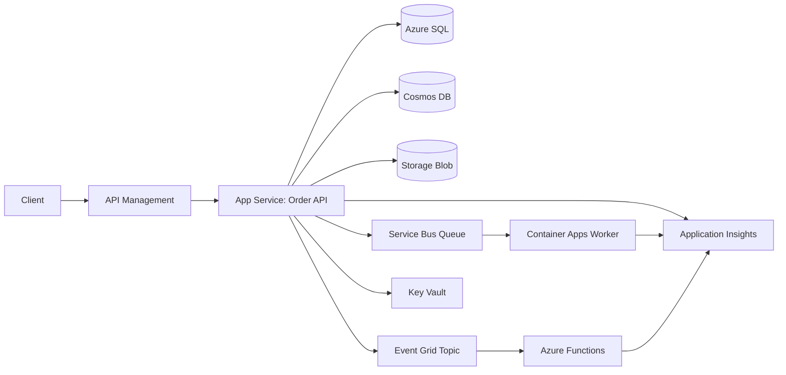

# Azure Order Flow Proof of Concept

This proof of concept demonstrates a small, end-to-end Azure workload built around managed identity, API ingress, relational and document persistence, asynchronous processing, and repeatable deployment.

## Architecture At A Glance

Primary flow:

`Client -> API Management -> OrderApi -> Azure SQL / Cosmos DB / Blob Storage -> Service Bus + Event Grid -> OrderWorker / OrderFunctions`

What each piece does:

- `API Management` fronts the API, requires subscriptions, and injects the backend API key.
- `OrderApi` runs on App Service and handles synchronous order intake.
- `Azure SQL` stores normalized order state.
- `Cosmos DB` stores the full order document.
- `Blob Storage` archives the original payload.
- `Service Bus` carries the background processing message.
- `Event Grid` publishes the order-created event.
- `OrderWorker` runs in Azure Container Apps and consumes Service Bus messages.
- `OrderFunctions` runs on Azure Functions and handles Event Grid events.
- `Key Vault` and managed identity provide the default access pattern for secrets and Azure resources.
- `Application Insights` receives traces, logs, and dependency telemetry.

## PoC Question

Can a managed-identity-first Azure application process an order through synchronous API intake, asynchronous messaging, event notification, relational persistence, document persistence, blob archival, and observable worker processing with a repeatable deployment path?

## Architecture



## Service Map

| Azure service | Use in this PoC |
| --- | --- |
| App Service | Hosts the order intake API behind APIM and validates the APIM-injected backend key. |
| API Management | Publishes the API surface, requires subscriptions, rate limits requests, and injects the backend key. |
| Azure SQL | Stores normalized order status records. |
| Cosmos DB | Stores full order documents for flexible reads. |
| Azure Storage | Archives original order payloads as blobs and provides separate identity-backed Function host storage. |
| Service Bus | Decouples order processing from API intake. |
| Event Grid | Emits order-created lifecycle events. |
| Azure Functions | Handles Event Grid events for notifications or projections. |
| Container Apps | Runs the background order worker. |
| Key Vault | Stores application configuration and connection strings. |
| Managed Identity | Grants apps access to Azure resources without embedded secrets. |
| Application Insights | Captures traces, logs, dependencies, and metrics. |
| CI/CD | GitHub Actions builds, validates, provisions, and deploys. |

## Repository Layout

```text
.
├── .github/workflows/azure-poc.yml
├── docs/
│   ├── architecture-decision-record.md
│   ├── test-plan.md
│   └── runbook.md
├── infra/
│   ├── main.bicep
│   └── main.parameters.json
├── scripts/
│   └── deploy.sh
└── src/
    ├── OrderApi/
    ├── OrderFunctions/
    └── OrderWorker/
```

## Local Run

The repo is optimized for deployment through Azure and GitHub Actions, but the projects can still be built locally.

1. Install the .NET 10 SDK and Azure CLI.
2. Restore and build the apps:

   ```bash
   dotnet restore src/OrderApi/OrderApi.csproj --locked-mode
   dotnet restore src/OrderFunctions/OrderFunctions.csproj --locked-mode
   dotnet restore src/OrderWorker/OrderWorker.csproj --locked-mode

   dotnet build src/OrderApi/OrderApi.csproj
   dotnet build src/OrderFunctions/OrderFunctions.csproj
   dotnet build src/OrderWorker/OrderWorker.csproj
   ```

3. Deploy the infrastructure to a resource group:

   ```bash
   export SQL_ADMINISTRATOR_PASSWORD="<strong-password>"
   export ORDER_API_BACKEND_KEY="<random-backend-key>"
   ./scripts/deploy.sh
   ```

   The deploy script auto-detects the signed-in Azure account as the SQL Microsoft Entra administrator when possible. Override that behavior with `SQL_ENTRA_ADMIN_LOGIN` and `SQL_ENTRA_ADMIN_OBJECT_ID` if you need a different admin principal.

4. Bootstrap Azure SQL managed identity access after deployment by running [`scripts/sql-managed-identity-bootstrap.sql`](./scripts/sql-managed-identity-bootstrap.sql) as the Azure SQL Microsoft Entra administrator.

5. Submit a test request through API Management after deployment:

   ```bash
   curl -X POST "https://<apim-name>.azure-api.net/orders" \
     -H "Ocp-Apim-Subscription-Key: <subscription-key>" \
     -H "Content-Type: application/json" \
     -d '{
       "customerId": "cust-1001",
       "sku": "demo-widget",
       "quantity": 2
     }'
   ```

## Prerequisites

- Azure subscription with permission to create resource groups and role assignments.
- Azure CLI.
- .NET 10 SDK.
- GitHub repository with OpenID Connect configured for Azure deployment.
- Container registry or Container Apps-compatible build flow.

## Deployment Path

Deployment is intentionally split into infrastructure, application publish, SQL bootstrap, and worker-image release:

1. `scripts/deploy.sh` creates the resource group and deploys `infra/main.bicep` with the non-secret defaults from `infra/main.parameters.json`.
   The script also passes the signed-in Azure account as the SQL Microsoft Entra administrator when it can discover one, so the SQL server is ready for the data-plane bootstrap step.
2. The GitHub Actions workflow in [`.github/workflows/azure-poc.yml`](./.github/workflows/azure-poc.yml) validates security rules, restores in locked mode, builds the apps, validates and deploys Bicep, publishes the API and Functions apps, and wires the Event Grid subscription to `OrderEventFunction`.
3. The workflow builds the worker image from `src/OrderWorker/Dockerfile`, emits SBOM and provenance metadata, scans the pushed image with Trivy, deletes the pushed digest if the scan fails, signs the image with Cosign, verifies the signature, and updates Azure Container Apps by immutable digest.
4. Azure SQL schema and permissions are bootstrapped separately with [`scripts/sql-managed-identity-bootstrap.sql`](./scripts/sql-managed-identity-bootstrap.sql), because database users and roles are data-plane objects rather than ARM resources.

## CI/CD Setup

The workflow uses Azure OpenID Connect. Configure these GitHub secrets:

- `AZURE_CLIENT_ID`
- `AZURE_TENANT_ID`
- `AZURE_SUBSCRIPTION_ID`
- `SQL_ADMINISTRATOR_PASSWORD`
- `ORDER_API_BACKEND_KEY`

The production deployment workflow is restricted to `refs/heads/master`. It runs the local security validation script, restores NuGet packages in locked mode with vulnerability audit enabled, validates and deploys Bicep, publishes the App Service API, publishes the Function App, creates the Event Grid subscription after the Function exists, builds the worker image from digest-pinned base images with SBOM/provenance metadata, pushes it to Azure Container Registry, deletes the pushed digest if the HIGH/CRITICAL Trivy gate fails, signs the image with Sigstore, verifies the signature against the `master` workflow identity, and updates the Container App by immutable digest.

## Azure / AWS Comparison

This PoC is Azure-first, but the service roles map cleanly to AWS counterparts:

| Azure service | Closest AWS analogue | Notes |
| --- | --- | --- |
| API Management | Amazon API Gateway | Both front APIs and enforce auth, quotas, and monitoring. API Gateway is the AWS front door for REST, HTTP, and WebSocket APIs. |
| App Service | AWS App Runner | Both are managed web app platforms. AWS App Runner is simple and container-first, but AWS now says it is no longer open to new customers, so it is not a fresh choice for new builds. |
| Azure Container Apps | ECS on Fargate or App Runner-style managed containers | Container Apps is the Azure serverless container host here, especially for background processing and event-driven scaling. |
| Azure Functions | AWS Lambda | Both handle event-driven compute. |
| Service Bus | Amazon SQS / SNS | This PoC uses Service Bus as the operational queue; AWS often splits queueing and fanout across SQS and SNS. |
| Event Grid | Amazon EventBridge | Both are event distribution services for routing domain events to handlers. |
| Azure SQL | Amazon RDS for SQL Server / Amazon Aurora PostgreSQL | The best fit depends on whether SQL Server compatibility or relational portability matters more. |
| Cosmos DB | Amazon DynamoDB | Both are managed NoSQL stores, but they optimize for different access patterns and consistency models. |
| Blob Storage | Amazon S3 | Both are object stores for payload archival. |
| Key Vault | AWS Secrets Manager / AWS KMS | Key Vault centralizes secrets and keys; AWS commonly separates secret storage and key management. |
| Application Insights | Amazon CloudWatch + X-Ray | Both provide logs, metrics, and trace visibility. |

## Backlog

Suggested GitHub issue backlog for the next pass:

1. `#1` Add automated integration tests that deploy the stack and verify the end-to-end order flow.
2. `#2` Add a smoke-test script for direct App Service access so the backend-key guard stays covered.
3. `#3` Add dashboards and alerts for API latency, Service Bus depth, Event Grid delivery, and Function/worker failures.
4. `#4` Add dead-letter queue handling and replay tooling for failed Service Bus messages.
5. `#5` Add a clean teardown script that removes the resource group and any lingering registry artifacts.
6. `#6` Decide the long-term API authentication model for API Management after the PoC.
7. `#7` Decide whether the worker should remain on Container Apps or move to a different compute target.
8. `#8` Tighten SQL migration management if the PoC evolves from bootstrap SQL into a durable release process.

## Success Criteria

- An order can be submitted through API Management with a valid APIM subscription key.
- Direct App Service requests to `POST /orders` without the APIM backend key are rejected.
- The App Service API writes to Azure SQL, Cosmos DB, and Blob Storage.
- The API sends a Service Bus message and publishes an Event Grid event.
- The Container Apps worker consumes the Service Bus message.
- The Azure Function receives the Event Grid event.
- All app components emit traces and dependency telemetry to Application Insights.
- Access to Key Vault and data services uses managed identity wherever supported.
- Deployment is repeatable through Bicep and CI/CD.

## Assumptions

- The PoC is optimized for breadth of integration, not production hardening.
- SQL schema migration is represented by the SQL bootstrap script, not by runtime request handling.
- Secrets that must exist as connection strings are stored in Key Vault and referenced by managed identity-enabled apps.
- The sample code is intentionally thin and should be expanded with domain validation, auth policy, retry policies, and production-grade failure handling before real use.
