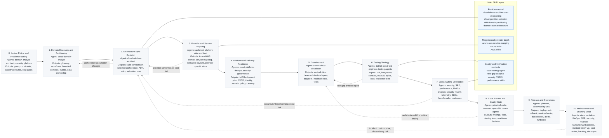

# Agentic Cloud .NET Engineering Workflow Diagram

```mermaid
flowchart LR
    A["0. Intake, Policy, and Problem Framing<br/>Agents: domain analyst, architect, security, platform<br/>Outputs: goals, constraints, quality attributes, stop gates"] --> B["1. Domain Discovery and Partitioning<br/>Agent: cloud-domain-analyst<br/>Outputs: glossary, workflows, bounded contexts, events, data ownership"]
    B --> C["2. Architecture Style Decision<br/>Agent: cloud-solution-architect<br/>Outputs: style comparison, selected architecture, ADR, risks, validation plan"]
    C --> D["3. Provider and Service Mapping<br/>Agents: architect, platform, data architect<br/>Outputs: Azure/AWS stance, service mapping, semantic caveats, provider-specific risks"]
    D --> E["4. Platform and Delivery Readiness<br/>Agents: cloud-platform-devops, security-governance<br/>Outputs: IaC/deployment plan, CI/CD, identity, secrets, policy, cleanup"]
    E --> F["5. Development<br/>Agent: dotnet-cloud-developer<br/>Outputs: vertical slice, clean architecture layers, adapters, health checks, tests"]
    F --> G["6. Testing Strategy<br/>Agents: dotnet-cloud-test-engineer, testing agents<br/>Outputs: unit, integration, contract, manual, spike, load, resilience tests"]
    G --> H["7. Cross-Cutting Verification<br/>Agents: security, SRE, performance, FinOps<br/>Outputs: security review, telemetry, SLOs, benchmarks, cost notes"]
    H --> I["8. Code Review and Quality Gate<br/>Agents: principal-code-reviewer, specialist review agents<br/>Outputs: findings, fixes, missing tests, readiness decision"]
    I --> J["9. Release and Operations<br/>Agents: platform, observability-SRE<br/>Outputs: deployment, rollback, smoke checks, dashboards, alerts, runbooks"]
    J --> K["10. Maintenance and Learning Loop<br/>Agents: documentation, FinOps, SRE, security, reviewer<br/>Outputs: ADR updates, incident follow-up, cost review, backlog, docs sync"]

    C -. "architecture assumption changed" .-> B
    D -. "provider semantics or cost fail" .-> C
    G -. "test gap or failed spike" .-> F
    H -. "security/SRE/performance/cost risk" .-> C
    I -. "architecture drift or critical finding" .-> F
    K -. "incident, cost surprise, dependency risk" .-> C

    subgraph Skills["Main Skill Layers"]
        S1["Provider-neutral<br/>cloud-dotnet-architecture-decisioning<br/>cloud-provider-selection<br/>ddd-domain-partitioning<br/>dotnet-clean-architecture"]
        S2["Mapping and provider depth<br/>azure-aws-service-mapping<br/>Azure skills<br/>AWS skills"]
        S3["Quality and verification<br/>run-tests<br/>code-testing-agent<br/>test-gap-analysis<br/>security / SRE / performance skills"]
    end

    C --- S1
    D --- S2
    G --- S3
    H --- S3

    classDef phase fill:#f5f7fa,stroke:#d6dee8,stroke-width:1px,color:#202a33;
    classDef skills fill:#eef6ff,stroke:#2f80ed,stroke-width:1px,color:#202a33;

    class A,B,C,D,E,F,G,H,I,J,K phase;
    class S1,S2,S3 skills;
```
